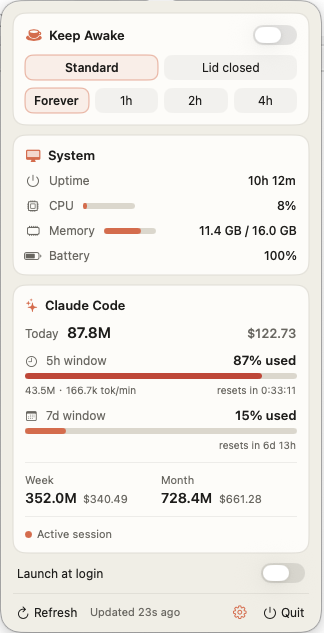

<div align="center">

# Oolong

**零凭据、一体化的 Claude Code 菜单栏驾驶舱** —— 用量、官方限流、保持唤醒、系统状态，一个原生面板全搞定，绝不碰你的 token。


[English](README.md) | 简体中文



<sub>把 <code>docs/screenshot.png</code> 换成你自己的截图。</sub>

</div>

---

Oolong 常驻菜单栏，把你用 Claude Code 时想随手看的信息都摆在一个下拉面板里：今天烧了多少 token / 多少钱、距离**官方 5 小时 / 7 天限流**还剩多少、机器的实时状态，以及跑长任务时一键**保持唤醒**。纯 Swift/SwiftUI，约 760 KB，没有 Electron。

> 只做 **Claude Code**（不含 Codex）。参考了社区的菜单栏工具，用原生重写，并配上 Claude 风格的暖色主题。

## 🆚 为什么选 Oolong？

Claude 用量监控工具不少，Oolong 选了一条不同的路：**所有信息一个面板，且完全不碰你的凭据。**

| | Oolong | [ClaudeBar](https://github.com/tddworks/ClaudeBar) | [Claude-Usage-Tracker](https://github.com/hamed-elfayome/Claude-Usage-Tracker) | [ccseva](https://github.com/Iamshankhadeep/ccseva) | [ClaudeMeter](https://github.com/eddmann/ClaudeMeter) |
|---|---|---|---|---|---|
| 官方限流 % | ✅ status line | ✅ CLI / OAuth | ✅ cookie | ❌ 本地估算 | ✅ cookie |
| 需要的凭据 | **无** | OAuth token | claude.ai cookie | 无 | claude.ai cookie |
| 用量相关网络请求 | **无** | api.anthropic.com | claude.ai | 无 | claude.ai |
| 保持唤醒（防睡眠/合盖不睡） | ✅ | ❌ | ❌ | ❌ | ❌ |
| 系统状态（CPU/内存/电池） | ✅ | ❌ | ❌ | ❌ | ❌ |
| 技术栈 | Swift，约 760 KB | Swift | Swift | Electron | Swift |

诚实的取舍：Oolong 的限流百分比只在 Claude Code 活跃时刷新（重置倒计时任何时候都准确）。如果你需要多家配额（Codex/Gemini/Copilot…）或随时刷新，上面这些项目做得很好——代价是要把 OAuth token 或 claude.ai cookie 交给它们。Oolong 两样都不读。

## ✨ 功能

- **Claude Code 用量** —— 今日 / 本周 / 本月的 **token 与花费**（通过 [`ccusage`](https://github.com/ryoppippi/ccusage) 在线定价，金额准确）。
- **官方限流** —— **5h** 和 **7d** 窗口的真实**已用百分比**与**重置倒计时**，和 `/usage` 同源。零凭据、零 API 调用、无 ToS 风险。
- **燃烧速率（burn rate）与活跃会话**指示。
- **保持唤醒** —— *标准防睡眠*（不息屏/不空闲睡）与*合盖也不睡*（合盖仍运行，基于 `pmset`），可选 **永久 / 1h / 2h / 4h** 自动关闭。
- **系统状态** —— 开机时长、CPU、内存、电池（原生 mach / IOKit）。
- **开机自启**（`SMAppService`）、手动刷新、退出。
- **Claude 暖色主题**，原生 `NSStatusItem` + 弹出面板，小屏/刘海屏也能放下（必要时面板内滚动）。
- **中英文界面**，面板底部 🌐 可切换语言（默认跟随系统语言）。

## 📦 环境要求

- **macOS 13+**
- **Apple Silicon** —— 预编译 `.app` 是 `arm64`。Intel 机型请自行编译通用二进制（见 [开发](#-开发)）。
- 运行时需要 [**`ccusage`**](https://github.com/ryoppippi/ccusage) 提供 token/花费数据。

## 🚀 安装

### 方式 A —— 下载
1. 从 [Releases](../../releases) 下载 `Oolong.app`，移动到 `/Applications`。
2. 首次启动（ad-hoc 签名）：右键 → **打开**，或清除隔离属性：
   ```bash
   xattr -dr com.apple.quarantine /Applications/Oolong.app
   ```

### 方式 B —— 源码编译
```bash
git clone https://github.com/adaiguoguo/Oolong.git
cd Oolong
make install        # 编译、打包、拷到 /Applications 并启动
```

## ⚙️ 配置

### 1. ccusage（token 与花费）
```bash
bun add -g ccusage      # 或：npm i -g ccusage
```
Oolong 会自动在 `~/.bun/bin`、Homebrew、npm-global 以及登录 `PATH` 中查找 `ccusage`。它使用**在线定价**，金额才准确（离线定价表是旧的，会把花费少算几十倍）。

### 2. 官方限流（5h / 7d）—— 推荐
Claude Code（≥ 2.1.x）会把实时限流数据通过 stdin 传给 **status line** 脚本。在你的 `~/.claude/statusline-command.sh` 里（紧跟在 `input=$(cat)` 之后）加**一行**，把这份数据交给 Oolong：

```bash
__ccbar_rl=$(jq -c '.rate_limits // empty' <<<"$input" 2>/dev/null); [ -n "$__ccbar_rl" ] && printf '%s' "$__ccbar_rl" > ~/.claude/ccbar-ratelimits.json
```

它会写入 `~/.claude/ccbar-ratelimits.json`，App 读取它。**不碰 token、不调 API、无凭据。** 不配置的话，5h 区域会回退到"按本地日志重建的时间窗口"（界面会明确标注为非官方数据）。

## 🖥 使用

点击菜单栏的 ☕ 茶杯图标打开面板。

- **保持唤醒** —— 先选*模式*和*时长*，再打开顶部开关。下面两排是开关的从属设置：关着时灰显/描边，打开后才填充成陶土橙生效。*合盖也不睡*会弹管理员密码（它切换的是 `pmset disablesleep`）。
- 其余信息只读，自动刷新（用量约 30 秒，系统状态/倒计时每秒）。

## 🔍 原理

| 数据 | 来源 |
|------|------|
| token 总量与花费 | `ccusage daily/weekly/monthly`（在线定价）|
| 5h / 7d 已用% + 重置 | Claude Code status-line stdin 里的 `rate_limits` |
| 燃烧速率、活跃 5h block | `ccusage blocks --active` |
| CPU / 内存 / 电池 / 开机时长 | `host_statistics`、`vm_statistics64`、IOKit、`ProcessInfo` |
| 保持唤醒 | `caffeinate -di` + `pmset -a disablesleep`（提权）|
| 开机自启 | `SMAppService` |

用量层封装在 `UsageProvider` 协议后面，方便以后把 `ccusage` 后端换成原生解析或内置 sidecar。

## 🛠 开发

```bash
make build      # swift build
make run        # 编译并运行（swift run）
make test       # 单元测试（swift-testing）
make probe      # 无 GUI 自检：打印系统 + 用量 + 限流 JSON，用于核对
make bundle     # 编译 release 并组装 dist/Oolong.app（ad-hoc 签名）
make install    # bundle + 拷到 /Applications + 打开
make clean
```

`make probe` 是验证工具 —— 输出 JSON 快照，可与 `ccusage` 的结果对比。要给 Intel Mac 出**通用二进制（arm64 + x86_64）**，请用双架构编译后重新打包。

### 测试

单元测试在 `Tests/OolongTests/`，使用 [swift-testing](https://github.com/swiftlang/swift-testing)（作为包依赖引入，纯 Command Line Tools 即可跑，无需完整 Xcode）。覆盖重点是踩过坑的纯逻辑：数字/时间格式化、模型边界、限流 JSON 解析（含浮点 `used_percentage` 回归）。CI 通过 GitHub Actions 在每次 push/PR 时跑 build + tests。

```
Sources/Oolong/
  App.swift               # @main；--probe 分支 + NSStatusItem/NSPopover 托管
  AppModel.swift          # @MainActor 状态机、定时器
  Models/                 # 数据模型 + 格式化
  Services/               # ccusage、限流文件、系统状态、caffeinate、登录项
  Views/                  # SwiftUI 面板 + 主题
```

## ⚠️ 已知限制

- **限流百分比**只在你**正在用 Claude Code**（status line 渲染）时刷新；**重置倒计时始终准确**（基于绝对时间戳）。空闲超过 2 分钟会标注"数据来自上次活跃会话"。
- **合盖也不睡**改的是系统电源设置。若 App 在开启状态被强杀，禁睡会残留 —— 手动恢复：
  ```bash
  sudo pmset -a disablesleep 0
  ```
- 预编译二进制是 **arm64**；Intel 需通用编译。
- `.app` 为 **ad-hoc 签名**（无付费 Developer ID），所以首次启动需要上面那一步。

## ❓ 常见问题

**菜单栏看不到图标（刘海屏 MacBook）。**
macOS 会把放不下的菜单栏图标隐藏，刘海又占掉中间一块——菜单栏一满，茶杯就可能被藏到刘海后面。这时 Oolong 其实还在运行。解决：按住 ⌘ 把茶杯**往右拖**到靠近时钟（最右侧永远可见）；关掉几个用不到的图标；或装个菜单栏管理工具如 [Ice](https://github.com/jordanbaird/Ice)（免费）收纳溢出图标。

**图标只在外接显示器出现，内置屏没有。**
开启「显示器具有单独空间」（默认）时，第三方菜单栏图标只显示在当前**活跃**的那块屏。点一下内置屏上的窗口让它变活跃，图标就会过去；或在「系统设置 → 桌面与程序坞」关掉该选项，变成单一固定菜单栏。

**用量/花费报错 `ccusage failed: env: node: No such file or directory`。**
GUI 应用继承的 PATH 很精简，找不到 Node。确认装了 `node` 和 `ccusage` 即可——Oolong 会注入你登录 shell 的 PATH，正常的 `bun add -g ccusage` / Homebrew 安装就能用。

**数字和 `/usage` 对不上。**
5h/7d 的**已用 % 和重置时间**与 `/usage` 一致（同源）；token/花费总量来自 `ccusage`，是另一套基于日志的指标。百分比只在 Claude Code 活跃时刷新，重置倒计时任何时候都准。

## 🔒 隐私

完全本地。Oolong 读取你本地的 Claude Code 日志（经由 `ccusage`）和你自愿开启的限流文件。唯一的联网是 `ccusage` 拉取**公开**的模型定价数据。不读取任何凭据，不上传任何内容，无遥测。

## 🤝 贡献

欢迎 issue 和 PR。保持小巧、原生、少依赖。

## 🙏 致谢

- [**ccusage**](https://github.com/ryoppippi/ccusage) —— token/花费引擎。
- Claude Code 团队把 `rate_limits` 暴露给 status-line 脚本。

## 📄 许可

[MIT](LICENSE) © 2026 Damon Zhou。
